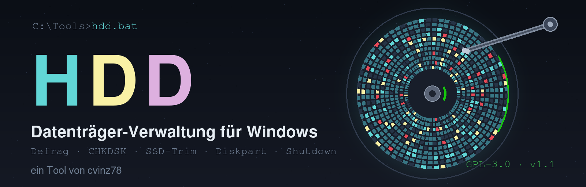
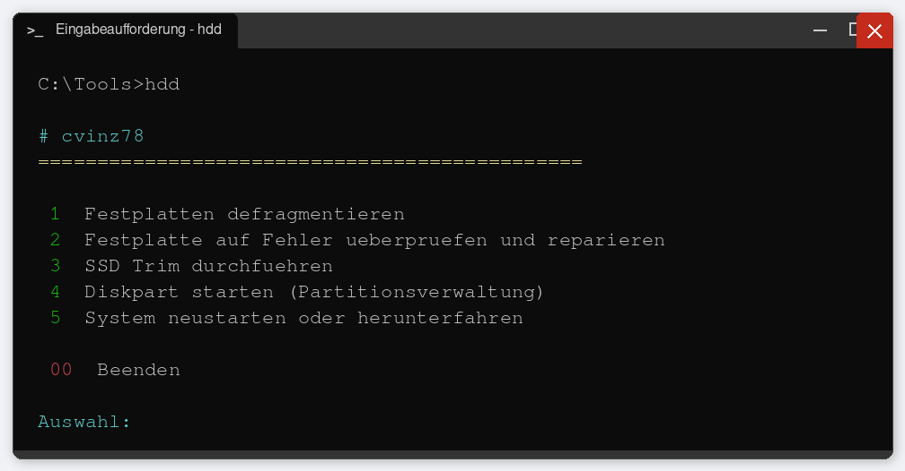
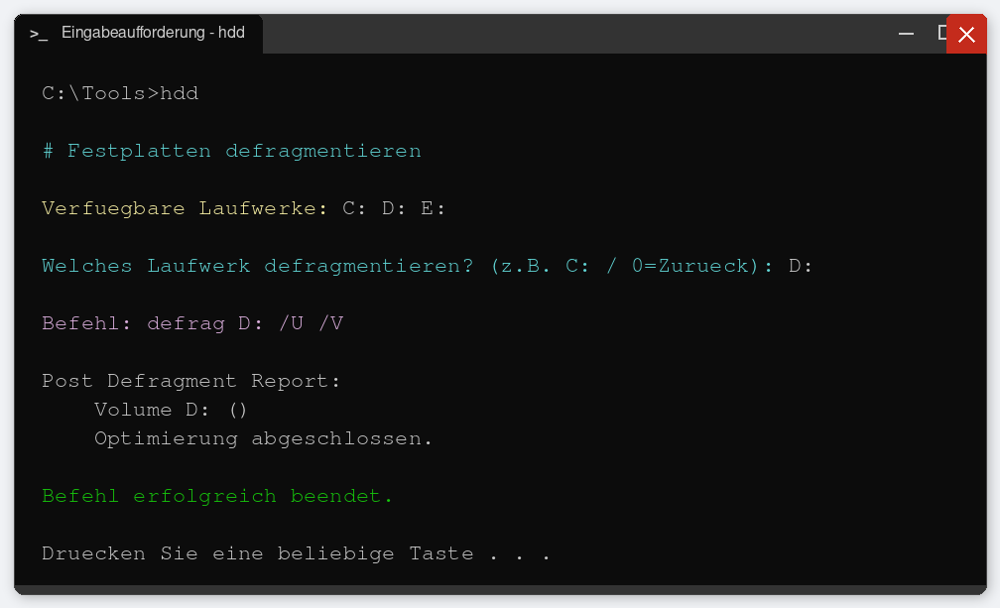
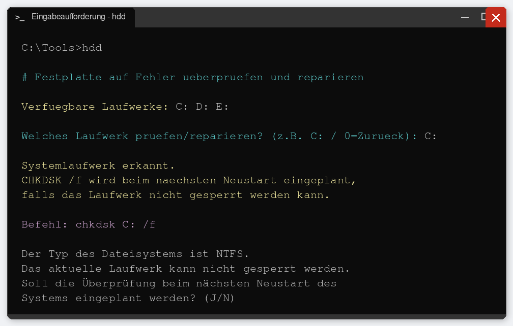
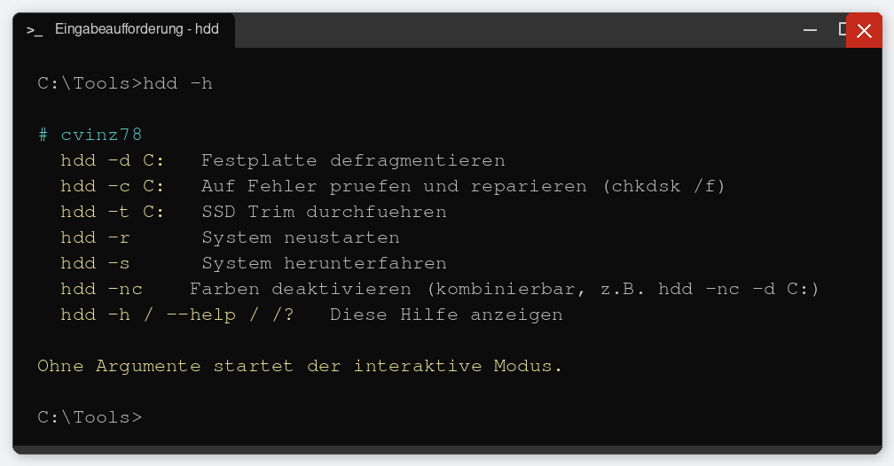

# HDD



**[🇩🇪 Deutsch](#-deutsch)** · **[🇬🇧 English](#-english)**

---

## 🇩🇪 Deutsch

**HDD** ist ein Windows-Batch-Skript (`hdd.bat`) von **cvinz78** zur Datenträger-Verwaltung mit farbigem Textmenü und Command-Line-Modus. Es bündelt die wichtigsten Wartungsaufgaben rund um Festplatten und SSDs in einem Werkzeug.

### Funktionen

| Menüpunkt | Beschreibung | Befehl |
|---|---|---|
| 1 | Festplatten defragmentieren | `defrag <Laufwerk> /U /V` |
| 2 | Festplatte auf Fehler prüfen und reparieren | `chkdsk <Laufwerk> /f` |
| 3 | SSD Trim durchführen | `Optimize-Volume -ReTrim -Verbose` |
| 4 | Diskpart starten (Partitionsverwaltung) | `diskpart` |
| 5 | System neustarten oder herunterfahren | `shutdown /r` bzw. `/s` |

### Installation

1. [`hdd.bat`](hdd.bat) herunterladen (z. B. nach `C:\Tools\hdd.bat`)
2. Optional: `C:\Tools` zur `PATH`-Umgebungsvariable hinzufügen, damit `hdd` aus jedem Verzeichnis aufrufbar ist

Weitere Voraussetzungen: Windows 10/11 mit PowerShell (ist Bestandteil von Windows). Beim ersten Start richtet das Skript die benötigten Administratorrechte automatisch ein (UAC-Abfrage).

### Verwendung

#### Interaktiver Modus

```
hdd
```

Startet das farbige Menü. Nach Auswahl einer Aktion werden die verfügbaren Laufwerke angezeigt und das Ziellaufwerk abgefragt (Eingabe `0` wechselt zurück ins Hauptmenü).

#### Argumentmodus

| Aufruf | Wirkung |
|---|---|
| `hdd -d C:` | Laufwerk C: defragmentieren |
| `hdd -c C:` | Laufwerk C: auf Fehler prüfen und reparieren |
| `hdd -t C:` | SSD-Trim für Laufwerk C: |
| `hdd -r` | System neustarten |
| `hdd -s` | System herunterfahren |
| `hdd -nc` | Farben deaktivieren (kombinierbar, z. B. `hdd -nc -d C:`) |
| `hdd -h`, `--help`, `/?` | Hilfe anzeigen |

Im Argumentmodus fragt das Skript nicht nach und gibt den Exitcode des ausgeführten Befehls zurück – praktisch für Automatisierung und die Weiterleitung in Dateien (dort empfiehlt sich `-nc`).

### Hinweise

- **Administratorrechte** werden für alle Aktionen benötigt; das Skript startet sich bei Bedarf automatisch mit erhöhten Rechten neu.
- Bei **`chkdsk C:`** erkennt das Skript das Systemlaufwerk und plant die Prüfung beim nächsten Neustart ein, falls das Laufwerk nicht gesperrt werden kann (Bestätigung mit `J`).
- **Diskpart** arbeitet direkt auf den Datenträgern – Befehle dort sorgfältig prüfen.
- Der Terminal-Emulator muss ANSI-Escape-Sequenzen unterstützen (Windows-Terminal und moderne Windows-Versionen tun dies standardmäßig; mit `-nc` läuft alles farblos).

### Lizenz

Copyright © 2026 cvinz78

Dieses Projekt ist unter der [GPL-3.0](LICENSE) (GNU General Public License v3.0) lizenziert.

---

## 🇬🇧 English

**HDD** is a Windows batch script (`hdd.bat`) by **cvinz78** for disk drive management with a colorful text menu and a command-line mode. It bundles the most important maintenance tasks for hard disks and SSDs into a single tool.

### Features

| Menu item | Description | Command |
|---|---|---|
| 1 | Defragment hard drives | `defrag <drive> /U /V` |
| 2 | Check and repair drives for errors | `chkdsk <drive> /f` |
| 3 | SSD TRIM | `Optimize-Volume -ReTrim -Verbose` |
| 4 | Start Diskpart (partition management) | `diskpart` |
| 5 | Restart or shut down the system | `shutdown /r` or `/s` |

### Installation

1. Download [`hdd.bat`](hdd.bat) (e.g. to `C:\Tools\hdd.bat`)
2. Optional: add `C:\Tools` to your `PATH` environment variable so `hdd` can be called from any directory

Requirements: Windows 10/11 with PowerShell (part of Windows). On first start, the script automatically elevates itself to administrator rights (UAC prompt).

### Usage

#### Interactive mode

```
hdd
```

Starts the colored menu. After choosing an action, the available drives are displayed and the target drive is requested (entering `0` returns to the main menu).

#### Argument mode

| Call | Effect |
|---|---|
| `hdd -d C:` | Defragment drive C: |
| `hdd -c C:` | Check and repair drive C: |
| `hdd -t C:` | SSD TRIM for drive C: |
| `hdd -r` | Restart the system |
| `hdd -s` | Shut down the system |
| `hdd -nc` | Disable colors (combinable, e.g. `hdd -nc -d C:`) |
| `hdd -h`, `--help`, `/?` | Show help |

In argument mode the script asks no questions and returns the exit code of the executed command – useful for automation and for redirecting output to files (where `-nc` is recommended).

### Notes

- **Administrator rights** are required for all actions; the script automatically restarts itself elevated when needed.
- For **`chkdsk C:`** the script detects the system drive and schedules the check for the next reboot if the drive cannot be locked (confirm with `Y`/`J`).
- **Diskpart** works directly on the disks – check its commands carefully.
- The terminal emulator must support ANSI escape sequences (Windows Terminal and recent Windows versions do this by default; use `-nc` to run without colors).

### License

Copyright © 2026 cvinz78

This project is licensed under the [GPL-3.0](LICENSE) (GNU General Public License v3.0).

---

## Screenshots

### Hauptmenü (interaktiver Modus) · Main menu (interactive mode)


### Festplatte defragmentieren · Defragment a drive


### CHKDSK mit Systemlaufwerk-Erkennung · CHKDSK with system drive detection


### Hilfe im Argumentmodus · Help in argument mode


[](https://www.gnu.org/licenses/gpl-3.0)
